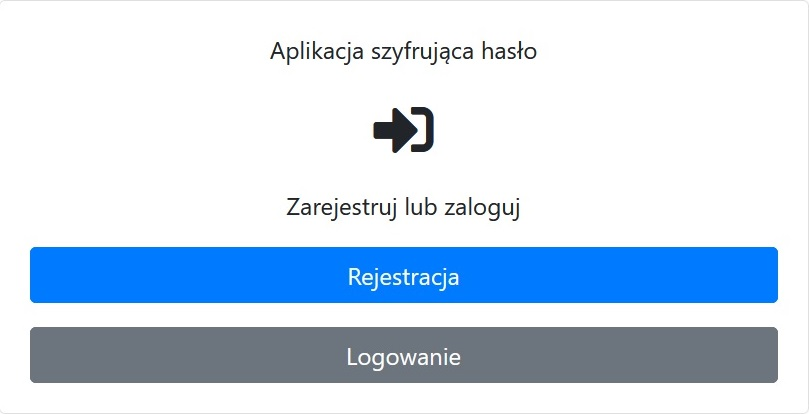

# Autentykacja
## Zawartość dokumentacji
* Główne informacje
* Jak działa?
* Dodatkowe funkcje
* Zdjęcia
* Użyte technologie
* Jak uruchomić

## Główne informacje


	
## Jak działa?


## Dodatkowe funkcje


## Zdjęcia




## Użyte technologie

- express,
- express-ejs-layouts,
- bcryptjs,
- passport,
- mongoose,
- connect-flash,
- express-session

## Jak uruchomić
Aby uruchomić projekt, należy zainstalować go lokalnie przy użyciu npm:

```
$ npm install

$ npm start
```
